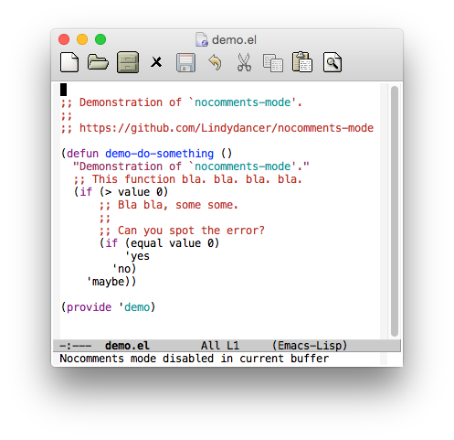
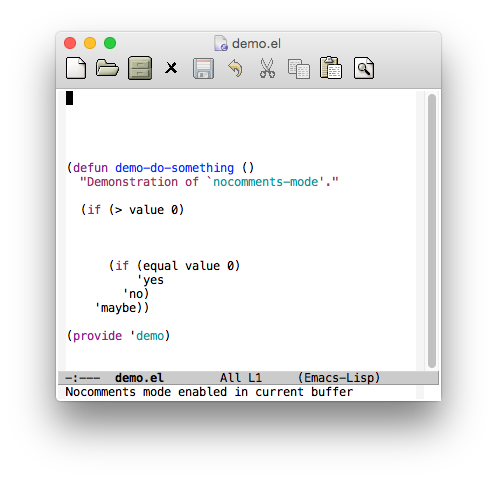

# nocomments-mode - Minor mode that makes comments invisible

*Author:* Anders Lindgren 
*Version:* 0.1.1 
*URL:* [https://github.com/Lindydancer/nocomments-mode](https://github.com/Lindydancer/nocomments-mode) 

Minor mode that can make all comments temporarily invisible.

In most situations, comments in a program are good.  However,
exuberant use of comments may make it harder to follow the flow of
the actual program.  By temporarily making comments invisble, the
program will stand out more clearly.

"Invisible" in this context means that the comments will not be
visible but they will still take up the same space they did before,
so non-comment portions will not move.

## Example

| Before                     | After                         |
| ------                     | -----                         |
|         |             |

## Install

Install this using the build-in Emacs package manager, e.g. using
<kbd>M-x package-install-from-file RET nocomments-mode.el RET</kbd>.

## Usage

This package provides two minor modes:

- `nocomments-mode` - Local minor mode that makes all comments in
  current buffer invisible.
- `nocomments-global-mode` - Global minor mode that makes all
  comments in all buffers invisible.

## Configuration

For convenience, you can bind a key to toggle the visibility of
comment.  For example, you can place the following in a suitable
init file to make F12 toggle comments:

        (global-set-key (kbd "<f12>") #'nocomments-mode)

---
Converted from `nocomments-mode.el` by [*el2markdown*](https://github.com/Lindydancer/el2markdown).
